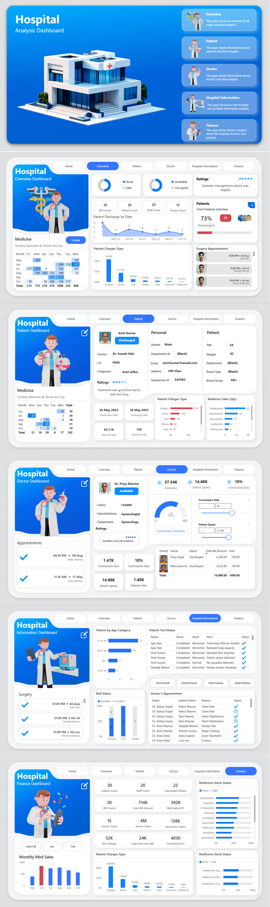

# 🏥 Hospital Analysis Dashboard  
**SQL + Power BI Project by Santhosh Babu**

---

## 📊 Project Overview  
This project presents an end-to-end **Hospital Analysis Dashboard** built using **SQL Views** and **Power BI**, transforming 15 Excel datasets into powerful visual insights.  
It focuses on hospital operations, patient management, doctor performance, and financial trends to support data-driven healthcare decisions.

---

## 🗂️ Data Pipeline  
1. Collected 15 Excel files containing hospital data.  
2. Imported all files into MySQL database `hospital_data`.  
3. Created SQL Views for data cleaning, joining, and transformation.  
4. Connected Power BI to MySQL to build visual dashboards.  
5. Designed KPIs and measures using DAX.  

---

## 🧱 Database Design  
**Database Name:** `hospital_data`  
Includes key views and tables:
- patient_info  
- doctor_info  
- beds_info  
- bills  
- appointments  
- patient_tests  
- medical_stock_info  
- medicine_patient  
- departments  
- satisfaction_score  

---

## 🧠 SQL Views Used  

### 1️⃣ patient_info_view.sql  
Combines patient, doctor, bed, and department data into a single relational view.  
This view helps track patient demographics, assigned doctors, room allocations, and admission status.  

### 2️⃣ medical_stock_info_view.sql  
Integrates medicine and supplier details to provide real-time insights into medicine stock, expiry dates, cost, and reorder levels.  

### 3️⃣ beds_info_view.sql  
Summarizes room and bed occupancy by room type and status (Available / Occupied).  

📂 *All SQL View scripts are stored in the `SQL_Views` folder for easy access and reference.*  

---

## 📸 Dashboard Preview

---

## 📈 Dashboards Overview  

### 1️⃣ Overview Dashboard  
- Shows total doctors, patients, staff, and active cases.  
- Highlights hospital summary metrics like admission rate, satisfaction rating, and occupancy rate.  

### 2️⃣ Patient Dashboard  
- Displays patient details, gender distribution, and admission status.  
- Shows discharge trends and test results.  

### 3️⃣ Doctor Dashboard  
- Shows doctor profiles, specializations, and experience.  
- Displays revenue contribution, commission estimation, and patient count.  

### 4️⃣ Hospital Info Dashboard  
- Visualizes bed allocation and room type utilization.  
- Displays patient-to-bed ratio and hospital occupancy.  

### 5️⃣ Finance Dashboard  
- Tracks total bill amount, test charges, medicine charges, and discounts.  
- Analyzes total income vs. expenses and charge type contribution.  

---

## ⚙️ DAX Measures
All key calculations — including total bill amount (after discount), patient distribution, and operational KPIs — are written in DAX for enhanced flexibility in Power BI.  

📄 DAX file: [`dax/hospital_measures.dax`](dax/hospital_measures.dax)

---

## 💡 Key Insights  
- 73% of patients were successfully discharged.  
- Surgery and medicine sales contribute the most to total revenue.  
- Female patients constitute 46% of total admissions.  
- ICU and general wards have the highest bed utilization.  
- Doctor satisfaction and efficiency increase with patient volume.  

---

## 🔗 Live Dashboard  
View the interactive version of the dashboard here:  
[**Power BI Live Dashboard**](https://app.powerbi.com/view?r=eyJrIjoiMzFlMjAyODUtYTcxZC00MTg0LWJkNGMtZWVhNjI1Mjk2NmU3IiwidCI6IjNjY2U5Nzc1LTVjN2QtNGFjOS1iNjBkLWU3OTk2NjM1M2U1ZiJ9)

---

## 📬 Contact
**Santhosh Babu S**  
📊 *Data Analyst Aspirant | SQL | Power BI | Python | DAX | Excel*  
📧 [santhoshbabus.analyst@gmail.com](mailto:santhoshbabus.analyst@gmail.com)  
🔗 [LinkedIn](https://www.linkedin.com/in/santhoshbabus) | [GitHub](https://github.com/santhoshbabu-analyst)
