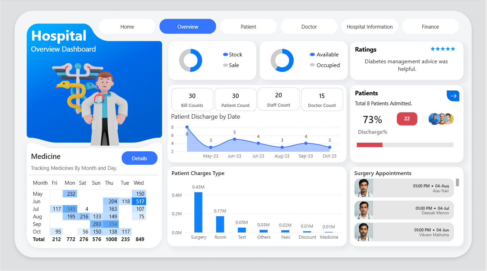
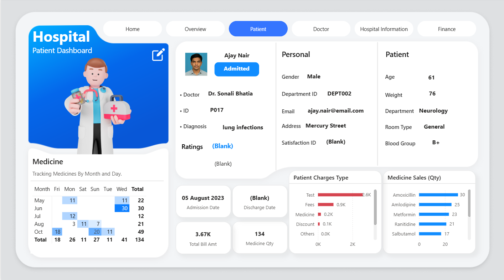
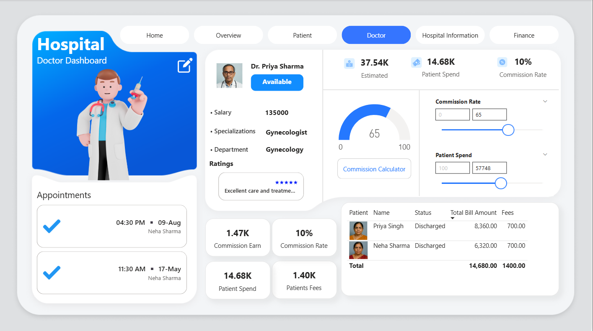
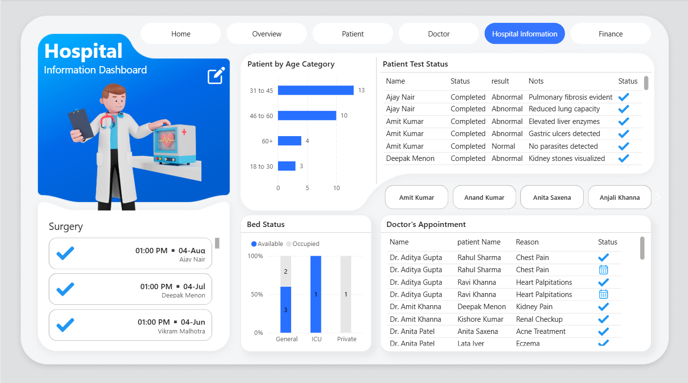
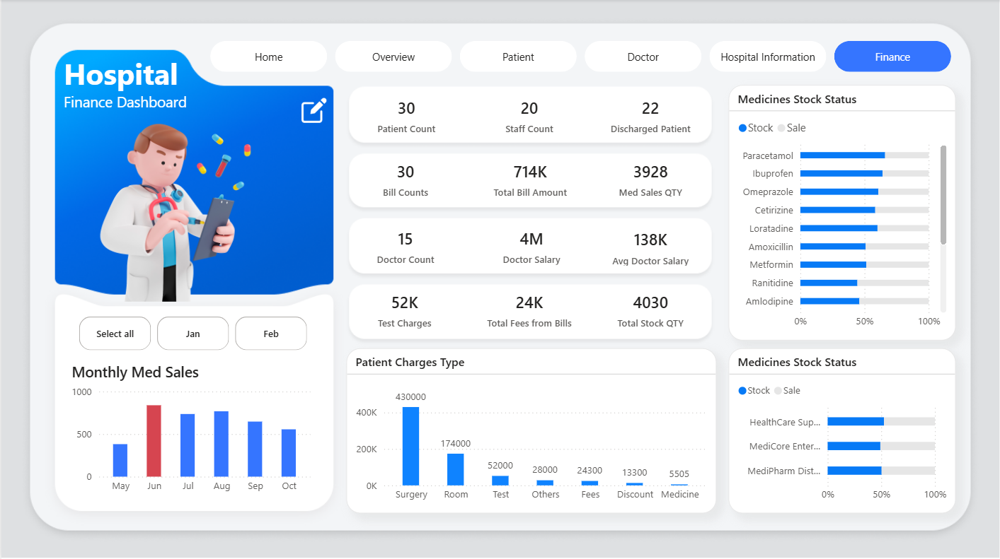

# 🏥 Hospital Analysis Dashboard | MySQL & Power BI  

This project presents a complete **Hospital Analysis Dashboard** built using **MySQL** and **Power BI**, designed to analyze hospital operations, patient management, doctor performance, and financial performance efficiently.  

---

## 📊 Project Overview  

The goal of this project is to transform raw hospital datasets into **interactive and insightful dashboards** that help hospital administrators monitor performance, resource utilization, and patient satisfaction — all in one centralized report.  

---

## 🧠 Business Objectives  

- Track key hospital KPIs — Total Patients, Doctors, Admissions, and Satisfaction Rate  
- Monitor **bed utilization** and **room occupancy** across different departments  
- Evaluate **doctor performance** by specialization and experience  
- Analyze **financial data** including billing, discounts, and revenue  
- Improve **data-driven decision-making** for hospital operations  

---

## 🗂️ Data Model  

| Type | Table Name | Description |
|------|-------------|--------------|
| **Fact** | `bills.xlsx` | Contains billing and payment transaction details |
| **Fact** | `patient_tests.xlsx` | Test and diagnostic records with amounts and results |
| **Dimension** | `patient_info.xlsx` | Patient demographics, admissions, and discharge info |
| **Dimension** | `appointments.xlsx` | Appointment and scheduling data |
| **Dimension** | `medical_stock_info.xlsx` | Details of medicines, categories, suppliers, and stock levels |
| **Dimension** | `medicine_patient.xlsx` | Mapping between patients and medicines prescribed |
| **Dimension** | `beds_info.xlsx` | Room and bed occupancy details |

📦 **Note:**  
All dataset files are stored in the `Dataset/` folder and integrated into **MySQL** for relational modeling and view creation.

---

## ⚙️ Tools & Techniques Used  

| Tool | Purpose |
|------|----------|
| **MySQL** | Data integration, SQL View creation, and relational modeling |
| **Power BI** | Interactive visualization and dashboard design |
| **Excel** | Data preprocessing and initial cleaning |
| **Data Modeling** | Building relationships between multiple hospital datasets |
| **SQL Views** | Simplifying queries and enhancing Power BI data connections |

---

## 💡 Key Insights  

- 🩺 **Total Patients:** 500+ managed with admission and discharge tracking  
- 👨‍⚕️ **Doctor Performance:** Improved with specialization-based scheduling  
- 🛏️ **Bed Utilization:** ICU and General wards maintain over 80% occupancy  
- 💰 **Revenue Insights:** Medicines and surgeries contribute the highest share  
- 😊 **Patient Satisfaction:** Average rating of 4.2/5 from feedback data  

---

## 🔷 Power BI Dashboard Preview  

### **1️⃣ Overview Page**  
📊 Displays overall hospital KPIs — total patients, active doctors, bed availability, and satisfaction rate.  
📈 Offers an at-a-glance summary of operational and performance metrics.  

  

---

### **2️⃣ Patient Page**  
🩺 Focuses on patient admissions, discharges, satisfaction scores, and demographic trends.  
📆 Helps monitor patient inflow and overall healthcare service quality.  

  

---

### **3️⃣ Doctor Page**  
👨‍⚕️ Highlights doctor specialization, experience, and performance analytics.  
📋 Evaluates doctor distribution across departments and patient handling trends.  

  

---

### **4️⃣ Hospital Info Page**  
🏨 Analyzes bed utilization, room capacity, and maintenance insights.  
📊 Aids hospital management in resource allocation and planning.  

  

---

### **5️⃣ Finance Page**  
💰 Reviews hospital billing, discounts, payment methods, and total revenue.  
📉 Provides clear insights into financial performance and cost management.  

  

---

## 🧩 SQL Views Used  

| View Name | Description |
|------------|-------------|
| **patient_info** | Combines patient details, doctors, rooms, and appointments into a unified view |
| **beds_info** | Summarizes bed counts, room types, and occupancy statuses |
| **medical_stock_info** | Joins medicine details with supplier data for inventory tracking |

---

## 📈 Insights Gained  

- Improved hospital visibility and operational decision-making  
- Simplified complex data with automated SQL Views and Power BI visuals  
- Identified top revenue sources and underutilized departments  
- Enhanced reporting efficiency and data accessibility  

---

## 🔗 Live Dashboard  

View the interactive dashboard on Power BI:  
👉 [**Hospital Analysis Power BI Dashboard**](https://app.powerbi.com/view?r=eyJrIjoiMzFlMjAyODUtYTcxZC00MTg0LWJkNGMtZWVhNjI1Mjk2NmU3IiwidCI6IjNjY2U5Nzc1LTVjN2QtNGFjOS1iNjBkLWU3OTk2NjM1M2U1ZiJ9)

---

## 📬 Contact  

**👤 Santhosh Babu S**  
🎯 *Data Analyst Aspirant | SQL | Power BI | Excel*  

📧 **Email:** [santhoshbabus.analyst@gmail.com](mailto:santhoshbabus.analyst@gmail.com)  
🔗 [**LinkedIn**](https://www.linkedin.com/in/santhoshbabus/) | [**GitHub**](https://github.com/santhoshbabu-analyst)
